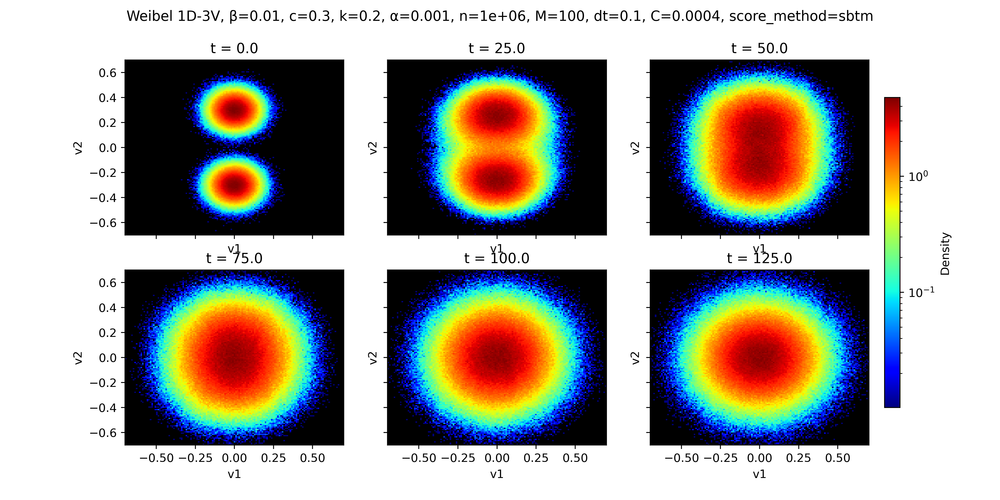

# Vlasov-Landau-SBTM

[](https://arxiv.org/abs/2603.25832)

Nuclear fusion promises nearly unlimited clean energy, but in order to get there we need to control a very hot gas called plasma. To do that, we need accurate simulation methods, which respect the physics: conservation of mass, momentum and total energy, and increase of entropy. We use a neural network as a subcomponent of the simulation to speed up the algorithm and make it more accurate, while respecting the physical laws.

While trying to compare the new numerical method to the previous SotA, we encountered a problem -- so little is known about the properties of the system we are simulating that we can barely tell which method is better. But looking at the experimental data, we formed a conjecture: the steady-state must be Gaussian. We asked #Gemini DeepThink, and after a few iterations we had a detailed proof, which we confirmed by hand. But then I went further and autoformalized the proof in #Lean4.

Considering that Claude wrote most of the code, this work represents the full cycle of semi-autonomous mathematical research: an AI wrote code to generate data, a human made a conjecture by looking at the data, another AI proved the conjecture, and a third AI formalized the proof in Lean.

Related papers: [math paper](https://arxiv.org/abs/2505.10037), [formalization paper](https://arxiv.org/abs/2504.15509)

<p align="center">
  
  <br>
  <em>Weibel instability (3D velocity): SBTM thermalizes correctly to Maxwellian equilibrium.</em>
</p>

## Setup

Requires Python 3.10+ with a CUDA-capable GPU.

```bash
pip install jax[cuda] flax optax orbax-checkpoint wandb matplotlib scipy
```

## Usage

Three experiments are provided: Landau damping, two-stream instability, and Weibel instability.

```bash
# Landau damping with SBTM (n=1M particles)
python experiments/vlasov-landau-damping.py --n 1000000 --M 100 --dt 0.02 --C 0.4 --score_method sbtm --gpu 0

# Two-stream instability with blob (KDE)
python experiments/vlasov-landau-two-stream.py --n 1000000 --M 100 --dt 0.05 --C 0.32 --score_method blob --gpu 0

# Weibel instability (electromagnetic)
python experiments/vlasov-landau-weibel.py --n 1000000 --M 100 --dt 0.1 --C 0.0001 --dv 3 --score_method sbtm --gpu 0
```

Key arguments:
- `--n`: number of particles
- `--M`: spatial grid cells
- `--dt`: time step
- `--C`: collision strength (0 = collisionless)
- `--score_method`: `sbtm` or `blob`
- `--dv`: velocity dimensions (2 or 3)

Results are logged to [Weights & Biases](https://wandb.ai). Set `--wandb_project` and `--wandb_run_name` to customize.

## Code Structure

| File | Description |
| ---- | ----------- |
| `experiments/vlasov-landau-damping.py` | Landau damping experiment (electrostatic) |
| `experiments/vlasov-landau-two-stream.py` | Two-stream instability experiment (electrostatic) |
| `experiments/vlasov-landau-weibel.py` | Weibel instability experiment (electromagnetic) |
| `src/score_model.py` | MLP and ResNet score network architectures |
| `src/loss.py` | Implicit and explicit score matching losses |
| `src/utils.py` | Training loops and visualization |

## Citation

```bibtex
@article{ilin2026neural,
  title={A Neural Score-Based Particle Method for the {V}lasov-{M}axwell-{L}andau System},
  author={Ilin, Vasily and Hu, Jingwei},
  journal={ICLR 2026 Workshop on AI and PDEs},
  year={2026},
  eprint={2603.25832},
  archivePrefix={arXiv},
  primaryClass={math.NA}
}
```
